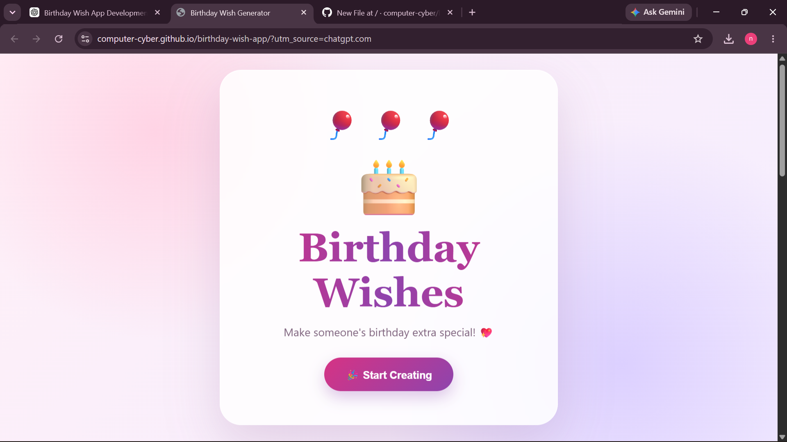
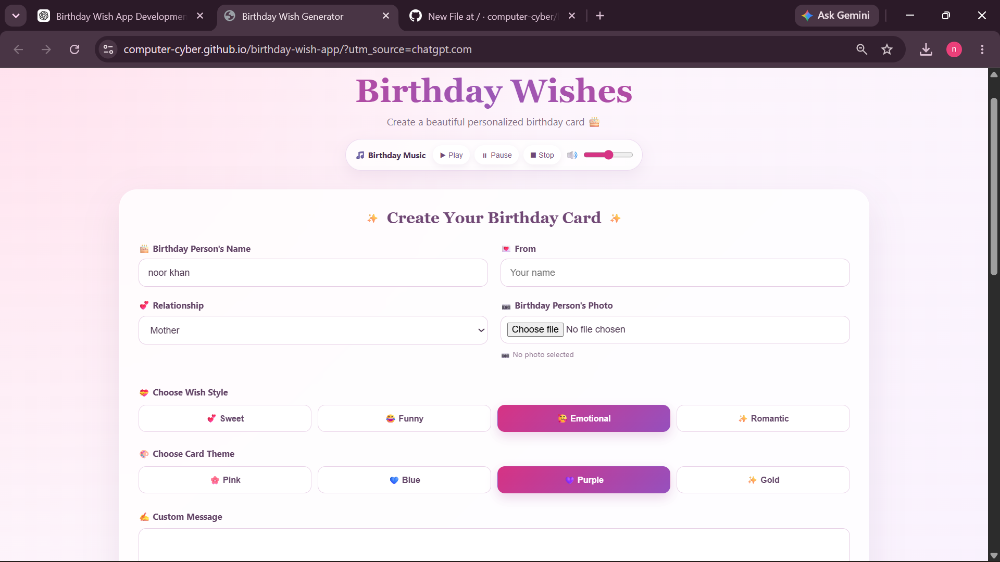
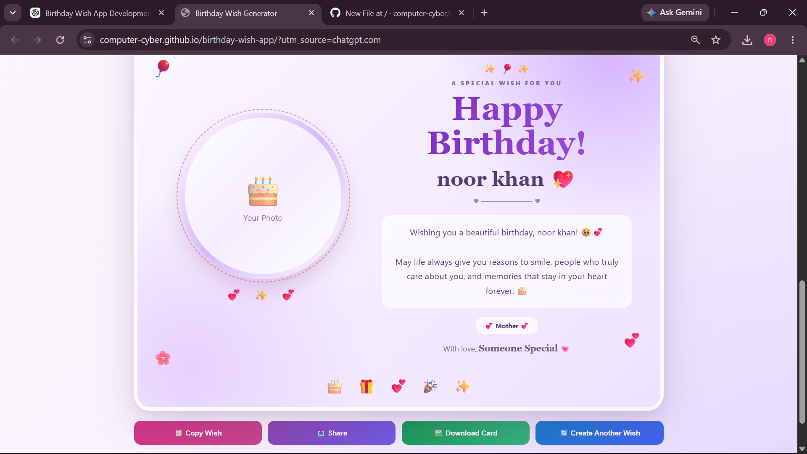

# 🎂 Birthday Wish Generator

A beautiful and interactive Birthday Wish Generator that helps you create personalized birthday wishes and cards.

## 🌐 Live Demo

👉 **Try the app:**  
https://computer-cyber.github.io/birthday-wish-app/

## ✨ Features

- 🎂 Personalized birthday wishes
- 👤 Enter the birthday person's name
- 📸 Upload a photo
- ✍️ Write a custom message
- 💕 Sweet wishes
- 😂 Funny wishes
- 🥰 Emotional wishes
- ✨ Romantic wishes
- 🎨 Multiple card themes
- 🎵 Birthday music
- 🔊 Music volume control
- 📋 Copy birthday wish
- 📤 Share birthday wish
- 🖼️ Download birthday card
- 🔄 Create another wish
- 📱 Responsive design

## 🎨 Card Themes

The app includes four beautiful themes:

- 🌸 Pink
- 💙 Blue
- 💜 Purple
- ✨ Gold

## 🛠️ Technologies

- HTML5
- CSS3
- JavaScript
- HTML2Canvas
- Web Audio API
- FileReader API
- LocalStorage

## 🚀 How to Use

1. Enter the birthday person's name.
2. Upload a photo.
3. Add a custom message if you want.
4. Select the relationship.
5. Choose a wish style.
6. Choose a card theme.
7. Click **Generate Wish**.
8. Copy, share, or download the birthday card.

## 📂 Project Structure

```text
birthday-wish-app/
├── index.html
├── style.css
├── script.js
└── README.md
## 📸 Screenshots

### 🎉 Welcome Screen

The beautiful welcome screen of the Birthday Wish Generator.



### 🎨 Create Your Birthday Card

Choose the birthday person's name, relationship, wish style, theme, photo, and custom message.



### 🎂 Generated Birthday Card

A personalized birthday card with the selected photo, theme, message, and relationship.




